## Project: Perception Pick & Place
### Writeup of the project.

### Exercise 1, 2 and 3 pipeline implemented
#### 1. Complete Exercise 1 steps. Pipeline for filtering and RANSAC plane fitting implemented.

### Note
For Exercise 1, 2 and 3, the functions are called within pcl_callback 
function of pr2_perception.py but they're contents are contained within 
the scripts directory.

#### Filtering

- The filtering performed on the input cloud data (Image 1) is performed in 
  filter_with_sof_voxel_passthorugh() (filtering.py). The image is processed
  with a statistical outlier filter (Image 2) which eliminates most of the 
  noise. 
- The data points are then downsampled using a volume-element (Voxel)
  grid method to reduce the number of data points required for processing; 
  this can be observed in (Image 3). 
- Lastly, the objects and the table are isolated by applying a passthrough 
  filter (voxel_to_passthrough) and are returned as pointcloud in 
  (Image 4). 

Image 1- Noisy Image
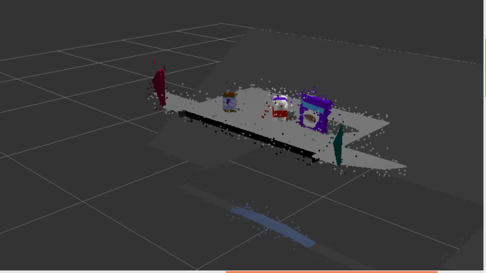

Image 2- Statistical Outlier Filterered Point Cloud
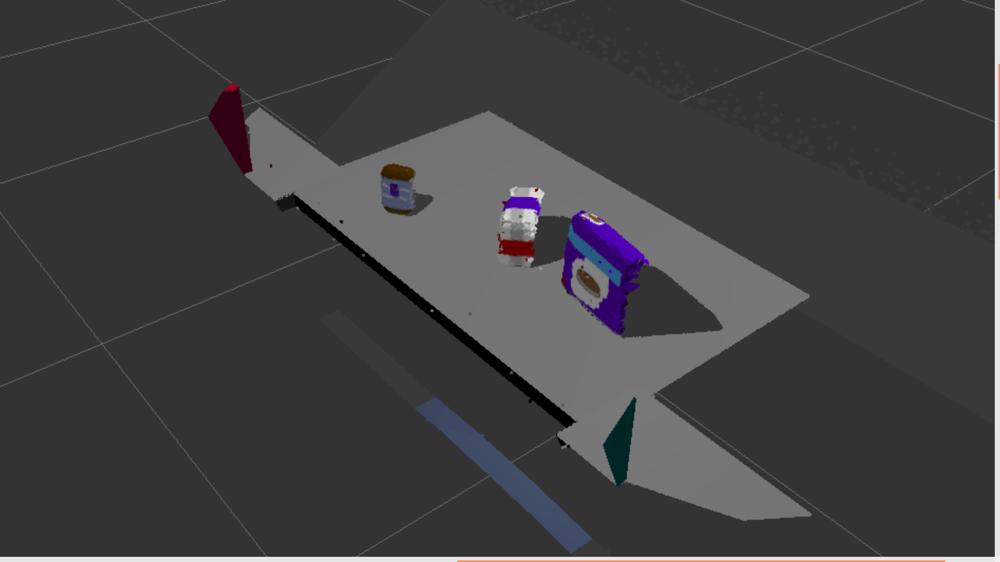

Image 3- Volume Element (Voxel) Downsampled Point Cloud
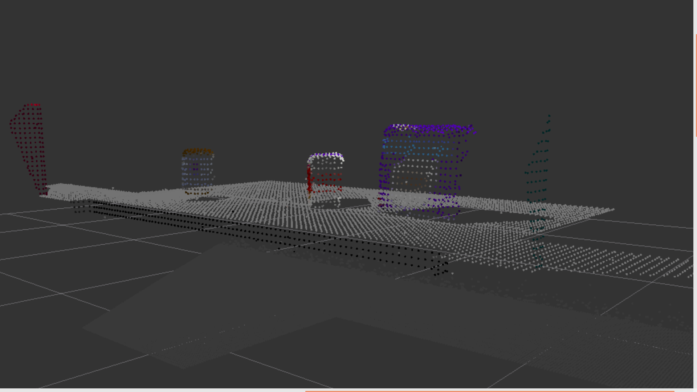

Image 4- Passthrough Filtered Point Cloud
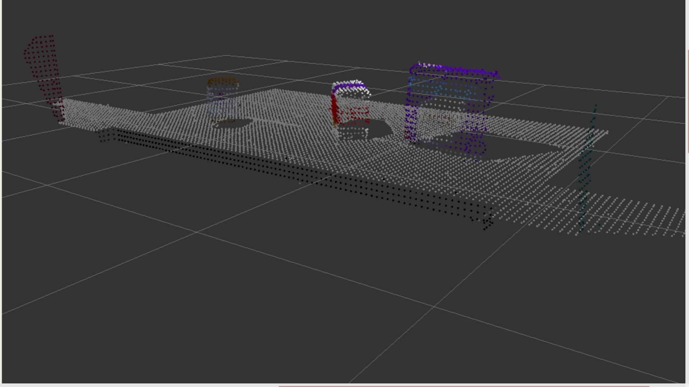

#### Segmenation

- Segmentation occurs within the segment_inliers_and_outliers_using_ransac()
  function in segmentation.py. This function is used to remove the table from 
  the point cloud (Image 5) and as such, extract the objects from 
  the point cloud (Image 6). 

- It performs this operation by comparing each data point to the pre-defined 
  model (in this case the table). If the data points are within a certain 
  threshold of the model, the data point is considered an inlier (valid table 
  data point) and if not it is an outlier (objects or noise).

Image 5- Table data points filtered using RANSAC algorithm
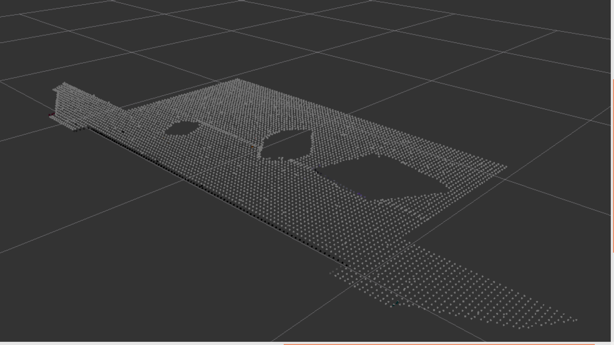

Image 6- Object data points filtered using RANSAC algorithm (with noise).
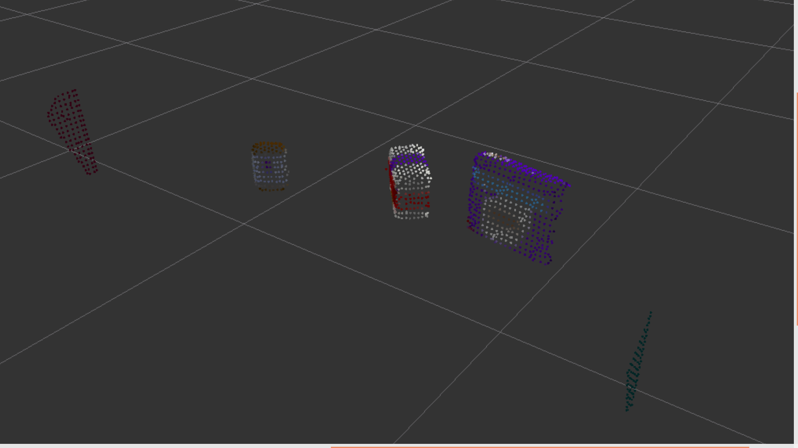

#### 2. Complete Exercise 2 steps: Pipeline including clustering for segmentation implemented.  

#### Clustering

- Euclidean clustering is implemented within extract_clusters() (imported from
  clustering.py). This groups data points that are within the Euclidean 
  distance of each other. Each group of data points are assigned a color and 
  outputted (cluster_cloud). The cluster_cloud for pick-list-1 can be seen below. 

Image 7- Clustered point cloud of objects (with some noise)
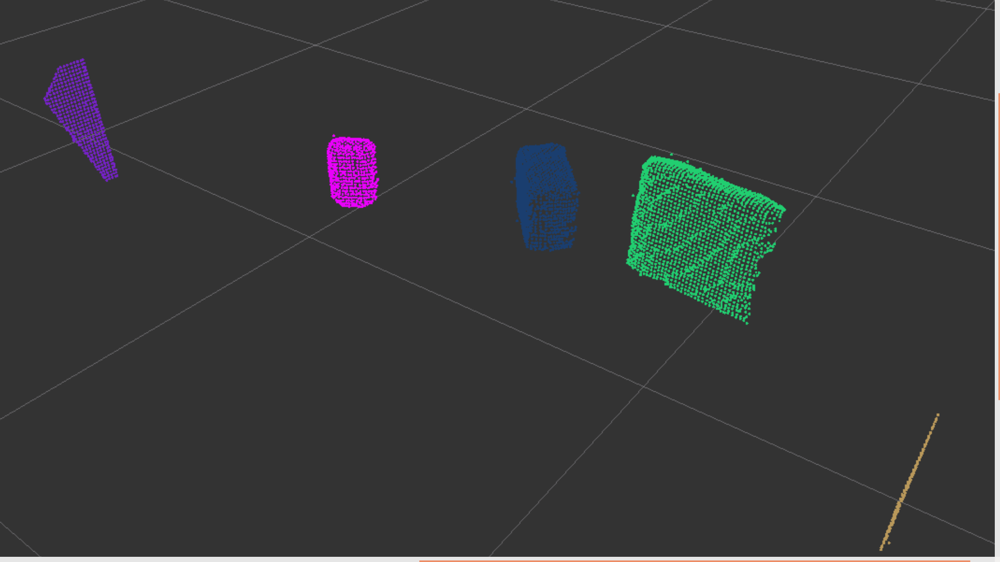

#### 2. Complete Exercise 3 Steps.  Features extracted and SVM trained.  Object recognition implemented.

#### Object_Recognition

##### Classifier
- The classifier was trained using both capture_features.py and train_svm.py.

- Firstly capture_features spawns the models of each object in a Gazebo
  environment, taking images of the objects. 
- It generates histograms from compute_color_histograms() and 
  compute_normal_histograms() and saves these to a file which obtains
  a unique feature profile of colour and surface normals for each object.
- The optimal captures for each objects was found to be 25.
- Next the support vector machine is trained in train_svm, defining the 
  classifier type. The optimal was configuration was found to be:
  clf = svm.SVC(kernel ='linear', gamma='scale', C=0.5). 

  The output of the trained classifier can be seen in 
  Image 8.

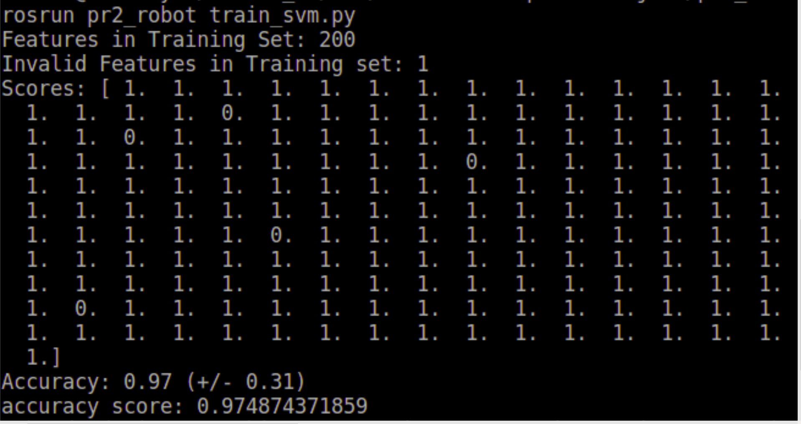

##### Detect Objects
- Within the perception pipeline in pr2_perception.py, the function 
  detect_objects() makes a prediction by comparing histograms of the classifier
  and the histograms of the incoming point_cloud data. 
- It then outputs a the label and the object cluster to detected_objects 
  which is then published to RViz.
- The output of detect_objects() for object recognition is displayed in Image 9-11
  for test worlds 1-3 respectively.
  
Image 9- Object Recognition for test world 1
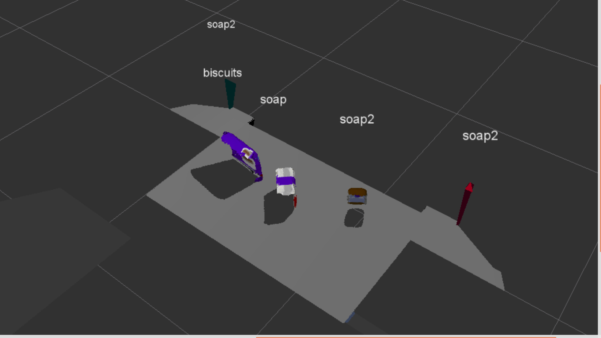

Image 10- Object Recognition for test world 2
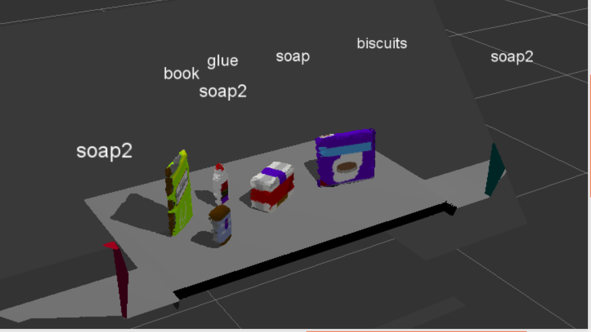

Image 11- Object Recognition for test world 3
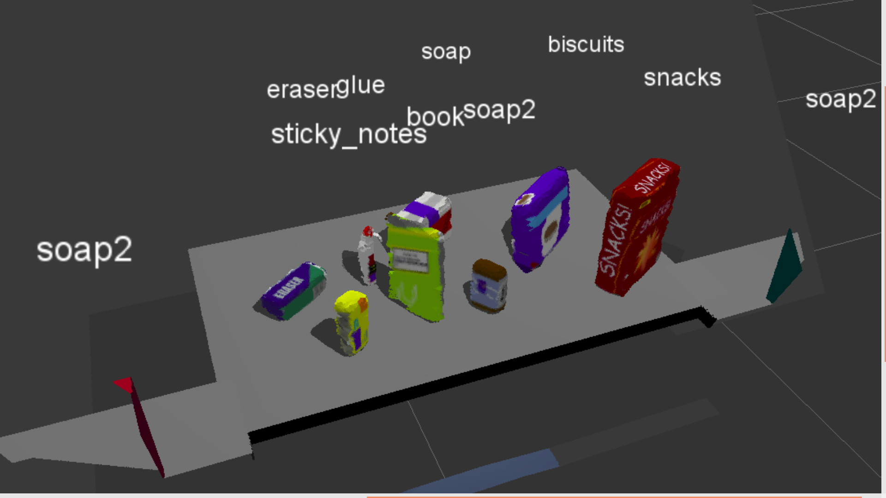

The outputs for the trained support vector machine in train_svm.py
can be seen as a normalised confusion matrix for each pick list.
The accuracy of each of the models are 97%, 98% and 97%

Image 12- Normalised Confusion Matrix for pick-list 1
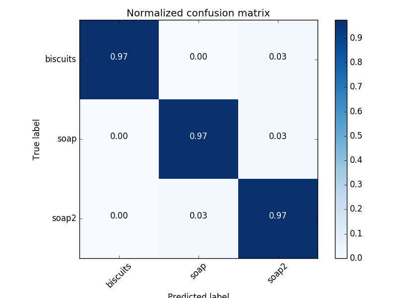

Image 13- Normalised Confusion Matrix for pick-list 2
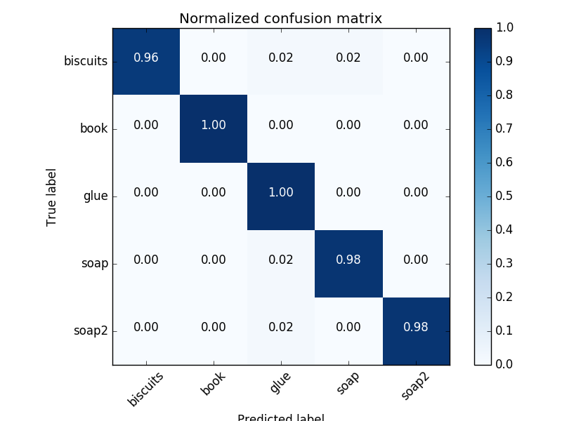

Image 14- Normalised Confusion Matrix for pick-list 3
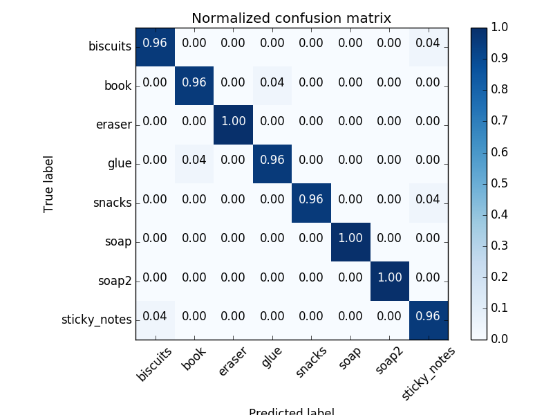

### Pick and Place Setup

#### 1. For all three tabletop setups (`test*.world`), 

#### Outputting PickPlace request to YAML file
- The first stage is to perform the object recognition in the pr2_perception.py 
  pcl_callback function. Just before this function ends, pr2_mover() is called.
- pr2_mover() is able to compare the items that are known to be in the scene 
  (pick_list objects), with the objects that pr2_perception has detected 
  (detected_objects). 
- For the objects that match the description, pr2_mover() then outputs a yaml 
  file which contains all the information attributed to the item in the 
  pick_list including location, dropbox, which arm to use etc.
- The output for each of the test scenes 1-3 can be found in output_#.yaml files
  in this directory.

#### Code critique and improvements

##### Rubric Pass criteria
- The pipeline must correctly identify:
  - 100% (3/3) of objects in test1.world,
  - 80% (4/5) in test2.world,
  - 75% (6/8) in test3.world.
- Perception pipeline must generate an output .yaml file for each pick-list with the following criteria:
  - arm_name
  - object_name
  - pick_pose
  - place_pose
  - test_scene_num

  
##### Rubric Outcome of criteria
- The perception pipeline in pr2_perception correctly identified:
  - 3/3 of objects in test1.world (Image 9) and 97% of objects correctly in the trained model (Image 12)
  - 5/5 of objects in test2.world (Image 10) and 98% of objects correctly in the trained model (Image 13)
  - 8/8 of objects in test3.world (Image 11) and 97% of objects correctly in the trained model (Image 14)
  
- The perception pipeline (specfically pr2_mover in pr2_perception) was able to output all 3 yaml files
  with the desired criteria for each test world file.

##### Critiques and Improvements

- Critique 1: Not removing the dropboxes from the pointcloud; This leads to 
  them being attributed labels which are not included in the pick_list files
  and therefore identifying wrongly; soap2 (Image 10, 11)

- Improvement 1: filter and segment these objects from the point cloud data

- Critique 2: The model is weakest at differentiating between objects XXX and 
  XXX. 

- Improvement 2: Increase the quality of the training set data by either: 
  - increasing the number of iterations in captured_features
  - Increase the number of point_cloud data points by decreasing the voxel-grid 
    downsampling

- Critique 3: The object 'biscuits' consistently is labelled twice, notably
  in the environment XXX.

- Improvement 3: Similar methods as explained in Improvement 2 also including
  optimising the HSV values for greater robustness of histogram for biscuits
  model.

